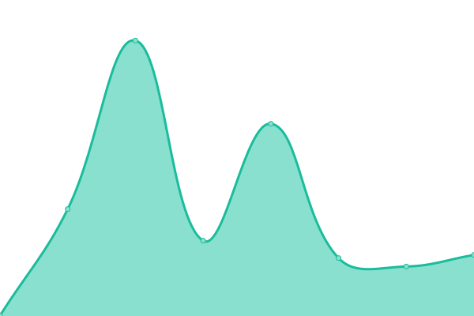

# Hometrace Status

This repository contains the uptime monitor and status page for Hometrace.

## Status

<!--start: status pages-->
<!-- This summary is generated by Upptime (https://github.com/upptime/upptime) -->
<!-- Do not edit this manually, your changes will be overwritten -->
<!-- prettier-ignore -->
| URL | Status | History | Response Time | Uptime |
| --- | ------ | ------- | ------------- | ------ |
|  [Homepage](https://www.hometrace.co) | 🟩 Up | [homepage.yml](https://github.com/hometrace-apps/status/commits/HEAD/history/homepage.yml) | 

 452ms
     
 | 

<a href="https://status.hometrace.co/history/homepage">100.00%</a>
    

|  [Sign In](https://www.hometrace.co/auth/signin) | 🟩 Up | [sign-in.yml](https://github.com/hometrace-apps/status/commits/HEAD/history/sign-in.yml) | 

 187ms
     
 | 

<a href="https://status.hometrace.co/history/sign-in">100.00%</a>
    

|  [Sign Up](https://www.hometrace.co/auth/signup) | 🟩 Up | [sign-up.yml](https://github.com/hometrace-apps/status/commits/HEAD/history/sign-up.yml) | 

 265ms
     
 | 

<a href="https://status.hometrace.co/history/sign-up">100.00%</a>
    

|  [API Health](https://www.hometrace.co/api/health) | 🟩 Up | [api-health.yml](https://github.com/hometrace-apps/status/commits/HEAD/history/api-health.yml) | 

 172ms
     
 | 

<a href="https://status.hometrace.co/history/api-health">100.00%</a>
    

|  [Storage Health](https://www.hometrace.co/api/storage/health) | 🟩 Up | [storage-health.yml](https://github.com/hometrace-apps/status/commits/HEAD/history/storage-health.yml) | 

 184ms
     
 | 

<a href="https://status.hometrace.co/history/storage-health">100.00%</a>
    

<!--end: status pages-->

## Live Status

Visit [status.hometrace.co](https://status.hometrace.co) for the full status page.

## License

Code in this repository is released under the MIT License.
